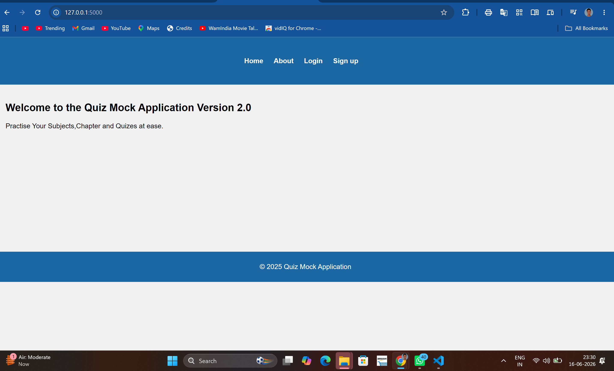
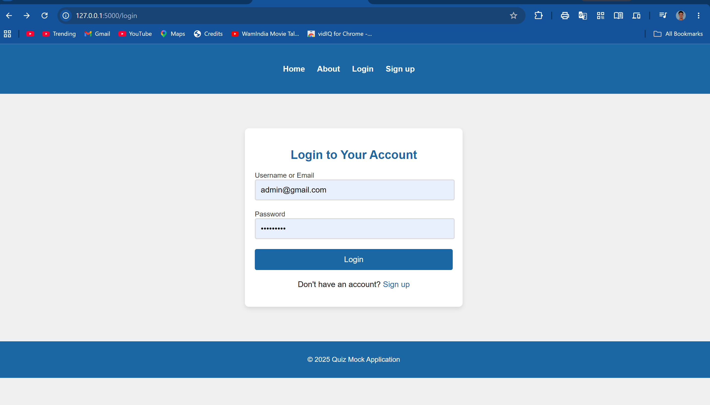
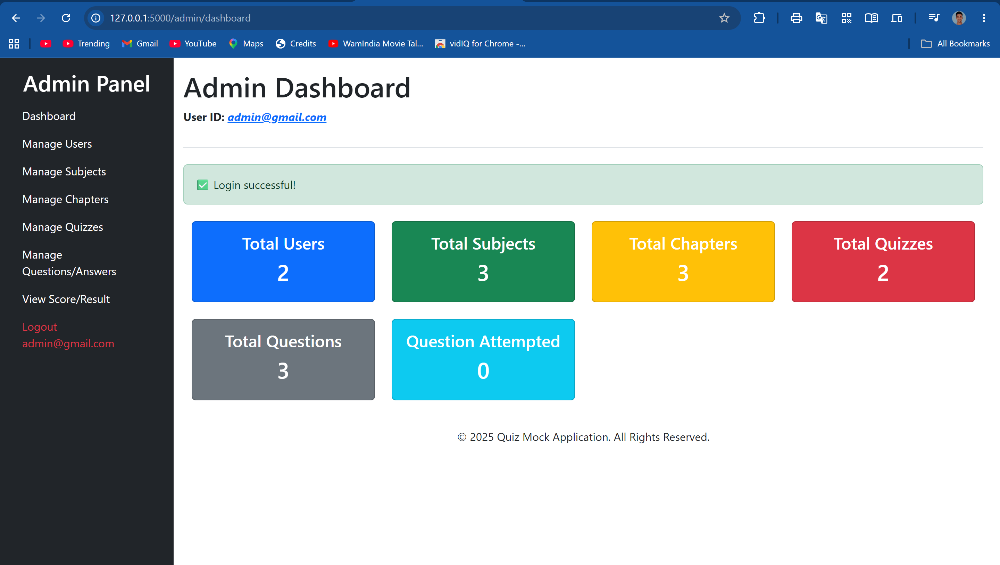

# QuizMaster - Flask Based Quiz Management System

## Overview

QuizMaster is a web-based Quiz Management System developed using Python, Flask, and SQLite. The application provides separate Admin and User modules, allowing administrators to create and manage subjects, chapters, quizzes, and questions while enabling users to register, participate in quizzes, and track their performance.

The project was developed in 2025 as part of the Master of Computer Applications (MCA) curriculum at Babu Banarasi Das University, Lucknow, and later published on GitHub in 2026 for portfolio and learning purposes.

---

## Key Features

### Admin Module

* Secure Admin Authentication
* Admin Dashboard
* Subject Management
* Chapter Management
* Quiz Creation and Scheduling
* Question Management
* User Monitoring
* Performance Tracking

### User Module

* User Registration
* Secure Login System
* Quiz Participation
* Instant Score Calculation
* Performance Analysis
* User Dashboard

---

## Technology Stack

| Technology   | Purpose             |
| ------------ | ------------------- |
| Python       | Backend Development |
| Flask        | Web Framework       |
| SQLite       | Database Management |
| HTML5        | Frontend Structure  |
| CSS3         | Styling             |
| Bootstrap    | Responsive UI       |
| Flask-Bcrypt | Password Encryption |

---

## Project Structure

```text
quiz_master/
│
├── app/
│   ├── components/
│   ├── controllers/
│   ├── middleware/
│   ├── models/
│   ├── routes/
│   ├── static/
│   └── templates/
│
├── screenshots/
│
├── database.db
├── requirements.txt
├── server.py
├── README.md
└── .gitignore
```

---

## Installation Guide

### Clone the Repository

```bash
git clone https://github.com/vineetkushwaha8858/QuizMaster-Flask-Quiz-Management-System.git
```

### Navigate to Project Directory

```bash
cd quiz_master
```

### Create Virtual Environment

```bash
python -m venv venv
```

### Activate Virtual Environment

Windows:

```bash
venv\Scripts\activate
```

### Install Dependencies

```bash
pip install -r requirements.txt
```

### Run Application

```bash
python server.py
```

### Open in Browser

```text
http://127.0.0.1:5000
```

---

## Screenshots

### Home Page



### Login Page



### Admin Dashboard



---

## Project Status

✅ Completed

This project is fully functional and demonstrates the implementation of a Quiz Management System using Flask and SQLite.

---

## Academic Information

**Project Title:** QuizMaster - Flask Based Quiz Management System

**Course:** Master of Computer Applications (MCA)

**University:** Babu Banarasi Das University, Lucknow

**Development Year:** 2025

**GitHub Publication:** 2026

---

## Future Enhancements

* Email Notifications
* Advanced Analytics Dashboard
* Quiz Leaderboard
* REST API Integration
* JWT Authentication
* Cloud Deployment
* Export Results in PDF/Excel

---

## Learning Outcomes

Through this project, I gained practical experience in:

* Flask Application Development
* Database Design using SQLite
* MVC-Based Project Structure
* Authentication and Authorization
* CRUD Operations
* Web Application Development
* Project Deployment Workflow
* Version Control using Git and GitHub

---

## Author

### Vineet Kushwaha

Master of Computer Applications (MCA)

Babu Banarasi Das University, Lucknow

Python Developer | Flask Developer | AI & ML Enthusiast

GitHub: https://github.com/vineetkushwaha8858

Developed as an MCA Major Project (2025)
Published on GitHub for Portfolio Showcase (2026)

---
